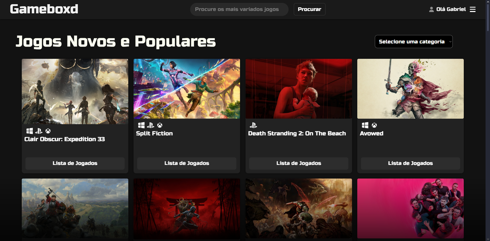
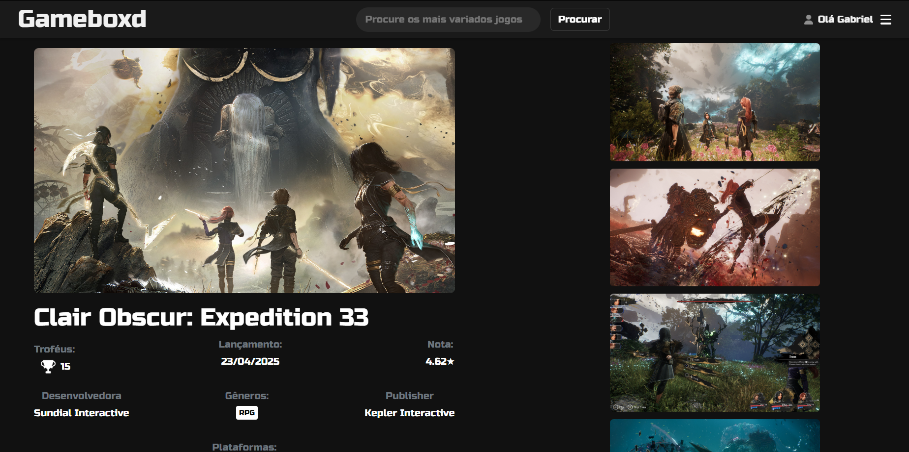

# 🎮 Projeto React - Gameboxd

Este projeto tem como ideia central servir como um catálogo de jogos digitais, através do consumo da API RAWg, que fornece dados de mais de 800 mil jogos.

## 🛠 Tecnologias Utilizadas

- [React]
- [Vite]
- [Bootstrap]

## 🎯 Objetivo

Demonstrar como construir uma aplicação **client-side** moderna com React, consumindo dados de uma API externa e exibindo essas informações de forma interativa e responsiva, bem como gerenciando os dados e preferências pessoais de conteúdo dos usuários.

## 📄 Descrição do Projeto

O sistema é composto por diversos **componentes reutilizáveis** que representam:

- Grid de Jogos;
- GameCards;
- Páginas focadas em jogos específicos;
- etc.

## ⚙️ Estrutura dos Componentes

- `AddList.jsx`: Componente que serve pra adicionar um jogo ao banco de dados pessoal do usuário;  
- `Dashboard.jsx`: Hub central do site;  
- `GameCard.jsx`: Componente principal, que mostra as informações e imagens de cada jogo;
- `GamesGrid.jsx`: Componente que organiza a ampla gama de cards de cada página;
- `GenrePage.jsx`: Busca de jogos por gênero;
- `Header.jsx`: Cabeçalho personalizado da baixa com campo de busca e menu hambúrguer;
- `LoginPage.jsx`: Cuida da parte de login e registro da aplicação;
- `MyList.jsx`: Mostra os jogos pessoais do usuário;
- `SearchPage.jsx`: Mostra os jogos que foram procurados via Header;
- `StarRating.jsx`: Pequeno componente que atua dentro do AddList.jsx, na parte da seleção da nota;
- `Wishlist.jsx`: Mostra os jogos que o usuário deseja jogar;
- `App.jsx`: Componente principal que orquestra a renderização das seções

## 📁 Organização de Pastas (Estrutura Geral)

- `src/`
  - `Components/`
    - `AddList/` → Componente para adicionar um jogo ao banco pessoal do usuário
    - `Dashboard/` → Hub central do site
    - `GameCard/` → Mostra as informações e imagens de cada jogo
    - `GamesGrid/` → Organiza os cards de jogos em grade
    - `GenrePage/` → Página de jogos por gênero
    - `Header/` → Cabeçalho com busca e menu hambúrguer
    - `LoginPage/` → Tela de login e registro
    - `MyList/` → Lista de jogos pessoais do usuário
    - `SearchPage/` → Resultados de busca
    - `StarRating/` → Seleção de nota dentro do AddList
    - `Wishlist/` → Jogos que o usuário deseja jogar
  - `App.jsx` → Componente principal que orquestra os outros componentes
  - `main.jsx` → Ponto de entrada da aplicação React
- `public/` → Contém o `index.html` e ícones públicos
- `.env` → Arquivo de variáveis de ambiente para configurar a API


## 🚀 Como Executar

1. Clone o repositório:
   ```bash
   git clone https://github.com/gabrielkazak/Gameboxd---Frontend
   cd frontend
   npm install
   crie um .env na raiz do projeto e adicione as URL alvo
   npm run dev
   acesse no navegador localhost:5173

## 💻 Repositório do Backend

https://github.com/gabrielkazak/Gameboxd---Backend

## 🖼️ Imagens do Site

Essa é a Dashboard do projeto, mostrando o grid de jogos recebidos dinamicamente pela api:



Essa é a página que aparece ao clicar em um jogo específico:



## 👤 Autor

    Gabriel – Estudante de Informática
    Projeto desenvolvido como prática de utilização de React.
